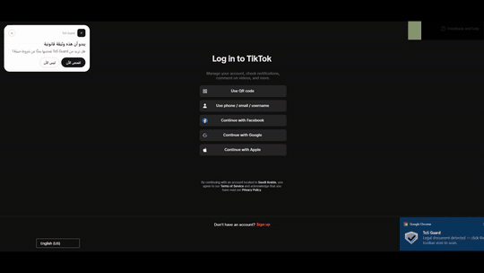

<div align="center">

# ToS Guard

**Read the fine print you were never going to read.**

ToS Guard is a Chrome/Edge extension that scans any Terms of Service, Privacy Policy, EULA, or cookie policy and tells you — in plain English and Arabic — which clauses are quietly working against you.

[](https://developer.chrome.com/docs/extensions/develop/migrate/what-is-mv3)
[](https://www.google.com/chrome/)
[](https://www.microsoft.com/edge)
[](LICENSE)
[](#)

كاشف الشروط الخبيثة في اتفاقيات الاستخدام وسياسات الخصوصية.

</div>

---

## 🎬 Demo

### Live walkthrough

A real screen recording of ToS Guard scanning **TikTok's Terms of Service** end to end — the extension detects the legal page, scans it with Gemini, scores it **85/100 (high risk)**, breaks down the flagged clauses in Arabic, and highlights the matching text directly on the page. The interface here is in **Arabic (RTL)**; the same flow works in English.

<div align="center">



▶️ **[Watch the full-quality version with sound (MP4)](assets/demo-live.mp4)**

</div>

### Animated overview

A short, programmatically-built montage of the product's key moments — detection, risk gauge, clause cards, bilingual explanations, and on-page highlighting.

<div align="center">


</div>

<!--
- demo-live.gif / demo-live.mp4: a real screen recording, edited (focus zoom + Arabic captions) with the Remotion project in /demo (src/FocusEdit.tsx). GIF autoplays inline; MP4 is full quality with sound.
- demo.gif / demo.mp4: the fully programmatic overview (src/Demo.tsx).
-->

---

## Why this exists

Nobody reads Terms of Service. Companies know that, and they bury the parts that matter — forced arbitration, "we can change these terms whenever we want," perpetual licenses over everything you upload, data sold to "partners" — under thousands of words of boilerplate.

ToS Guard does the reading for you. Open any legal page, hit **Scan**, and you get a risk score, a list of the specific clauses worth worrying about, and a one-line explanation of *why each one is a problem* — highlighted right on the page so you can see them in context.

It runs on **your own** Google Gemini API key. The key lives in your browser, your scans stay on your machine, and nothing is logged or sent to a server we control.

---

## Features

- **Automatic detection.** Land on a ToS or privacy page and a small banner offers to scan it. No detection happens until you ask.
- **Risk score, 0–100.** An animated gauge plus per-severity counts (high / medium / low) so you know at a glance how predatory a document is.
- **Clause-by-clause breakdown.** Expandable cards naming each risky clause, its category (arbitration, data-sharing, auto-renewal, liability waivers, and more), and a plain-language reason it matters.
- **Inline highlighting.** Flagged clauses are marked up directly in the page text — red, amber, and blue by severity — so you read them where they actually live.
- **Fully bilingual.** Every summary and explanation comes in English *and* Arabic, with proper RTL layout.
- **Local scan history.** Your last 100 scans, searchable and filterable, stored only in your browser.
- **No tracking.** No analytics, no telemetry, no third parties. Manifest V3, no remote code — GSAP and fonts are bundled in `/lib`.

---

## Install

ToS Guard isn't on the Chrome Web Store yet, so you load it unpacked. It takes about a minute.

1. **Download the code.**
   - Easiest: on the [GitHub page](https://github.com/UsoguiH/ToS-Guard-), click **Code → Download ZIP**, then unzip it.
   - Or with git:
     ```bash
     git clone https://github.com/UsoguiH/ToS-Guard-.git
     ```
2. **Open the extensions page** — go to `chrome://extensions` (or `edge://extensions`).
3. **Turn on Developer mode** with the toggle in the top-right corner.
4. **Click "Load unpacked"** and select the project folder — the one containing `manifest.json`.
5. The options page opens automatically. **Paste your Gemini API key** (see below) and you're done.

> Works on Chrome 116+ and any recent Chromium-based browser (Edge, Brave, Arc, Opera).

### Get a free Gemini API key

ToS Guard needs a Google Gemini key to do the analysis. The free tier is plenty for personal use.

1. Go to **[aistudio.google.com/app/apikey](https://aistudio.google.com/app/apikey)**.
2. Sign in with a Google account.
3. Click **Create API key** — it looks like `AIza...`.
4. Paste it into ToS Guard's options page and hit **Save** (there's a **Test** button to confirm it works).

You can switch models in the options page — `gemini-3.5-flash` (default, fast and recommended), `gemini-2.5-pro` (most thorough), or the lighter flash variants if you want to save quota.

---

## How to use it

**Automatic** — Open any Terms of Service, Privacy Policy, EULA, or cookie page. A banner slides in offering to scan. Click **Scan now** and the results open right there.

**Manual** — Click the ToS Guard toolbar icon on any page and press **Scan this page**. Or right-click anywhere and choose **Scan with ToS Guard**.

**Reading results** — Each flagged clause is a card you can expand for the full explanation. The matching text is highlighted on the page itself, colored by severity. The gauge at the top is the overall risk score.

**History** — Click the clock icon in the popup (or open Settings → *Open scan history*). Search by domain, title, or clause text; filter by risk level; expand any past scan; or jump back to the original page.

---

## How it works

```
 ┌─────────────┐   visible legal text    ┌──────────────────┐   POST + your key   ┌────────────┐
 │ content.js  │ ──────────────────────▶ │  background.js    │ ──────────────────▶ │  Gemini    │
 │  (the page) │                         │ (service worker)  │ ◀────────────────── │  API       │
 └─────────────┘                         └──────────────────┘   structured JSON   └────────────┘
        ▲                                          │
        │  highlight clauses                       │  risk score + clauses
        └──────────────  popup.js  ◀───────────────┘
```

1. The **content script** extracts the readable legal text from the page (stripping nav, scripts, and chrome), capped at ~60,000 characters.
2. The **service worker** sends it to Gemini with a strict prompt that asks for a single JSON object — risk score, document type, and up to 12 verbatim clause snippets with bilingual explanations.
3. The **popup** renders the score and clause cards, and asks the content script to highlight each verbatim snippet back on the live page.

The only outbound request is a `POST` to `generativelanguage.googleapis.com` carrying your own API key. That's it.

---

## Privacy

- Your API key is stored in `chrome.storage.local`. It never leaves your machine except in the `x-goog-api-key` header of the Gemini call *you* trigger.
- Page content is read only when you explicitly scan. Auto-detection is a local regex check — nothing is sent anywhere just because you visited a page.
- Scan history is local and capped at 100 entries. Clear it anytime.
- No analytics. No telemetry. No third parties.
- Full policy: [`legal/privacy.html`](legal/privacy.html) · Terms of use: [`legal/terms.html`](legal/terms.html)

---

## Project structure

```
manifest.json            MV3 manifest
background/               Service worker — Gemini calls, history, context menu
content/                  Page text extraction, auto-detect banner, inline highlighter
popup/                    Toolbar popup UI (results, gauge, clause cards)
options/                  Settings — API key, model, toggles, history link
history/                  Full scan-history browser
legal/                    Privacy policy + Terms of use (also used for the store listing)
offscreen/                Notification chime via Web Audio API (MV3 workaround)
icons/                    16 / 32 / 48 / 128 px icons
lib/                      Bundled GSAP + Inter/Cairo fonts (no remote loads)
assets/                   Static assets (chime, demo video/GIF/poster)
demo/                     Remotion source for the demo video (dev-only, not shipped)
build.ps1                 Packages a clean dist/*.zip for the Web Store
```

---

## Building a release

To produce a store-ready zip (strips dev files, validates the manifest and icons):

```powershell
.\build.ps1
```

This writes `dist/tos-guard-<version>.zip`. Pass `-OutDir <path>` for a custom location.

Publishing to the Chrome Web Store also needs a publicly hosted copy of the privacy policy (`legal/privacy.html` works on GitHub Pages, Netlify, Vercel, etc.) and the one-time $5 developer registration.

---

## Limitations

- Browser-internal pages (`chrome://`, the Web Store, `view-source:`) can't be scanned — that's a browser sandbox rule, not a bug.
- Very long documents are truncated to ~60,000 characters before analysis.
- Highlighting falls back gracefully when a clause spans multiple HTML elements.
- AI occasionally returns something unparseable; the popup shows a **Re-scan** button when that happens.
- **This is not legal advice.** Flagged clauses are AI heuristics meant to help you notice things — not a substitute for a lawyer.

---

## Contributing

Issues and pull requests are welcome. Good places to start: better clause detection for non-English documents, more robust highlighting across page layouts, and additional language support beyond EN/AR. If you're filing a bug, a link or screenshot of the page that misbehaved helps a lot.

---

## License

[MIT](LICENSE) © 2026 UsoguiH and ToS Guard contributors.
